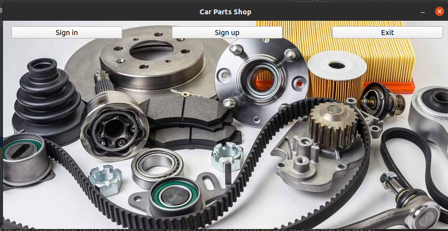

# Welcome to Car Parts Shop desktop application

## Idea
Car Parts Shop is desktop app for car spare parts.
The general idea of the app is to help Auto shops and auto mechanics to choose the correct spare part for clients.

## Current status
In development.

## Before first run
Install all modules(packages needed - All required modules for app can be found in "requirements.txt")
Database schemas included --> database_schema.sql - Empty database tables
Database schemas doesn't include create statement!
NOTE: Create config.ini file in root directory of the project and set it to your specific database info!

## Get help:
dimitar_hristov86@abv.bg or +359884156033

## Creator and maintenance:
Dimitar Hristov